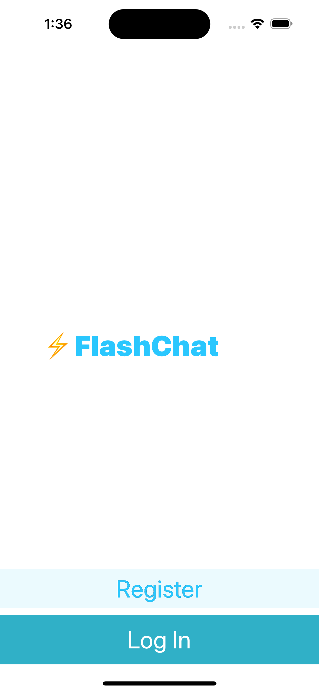
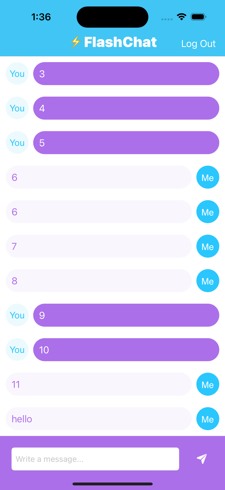

# Flash-Chat

A real-time chat messaging application for iOS built with Swift and Firebase Firestore.

## Features
- User registration and login.
- Real-time chat with other users.
- Messages are synchronized across devices.
- User authentication and data storage are handled by Firebase.
- Simple and intuitive user interface.

## Screenshots

OnBoarding             |        Login       |         Chat   
:-------------------------:|:-------------------------:|:-------------------------:
  |     |   

## Technologies Used
- Swift
- Firebase Firestore for real-time database and authentication.
- UIKit and TableView for the user interface.

## Firebase Configuration
The Firebase configuration and setup files are located in the project. Make sure to replace these with your own Firebase project's configuration for authentication and Firestore.

## License
This project is licensed under the MIT License - see the LICENSE file for details.

## Acknowledgments
Firebase - For real-time database and authentication services.
